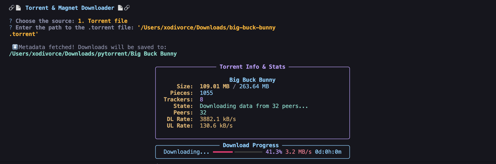

## Audio To Image Encryption

### 👀 Preview


#### A simple tool that encodes audio files into PNG images and decodes them back seamlessly, without any quality loss.

[](https://github.com/xodivorce/pytorrentapp/)
[](https://github.com/xodivorce/pytorrentapp/)
[](https://github.com/xodivorce/pytorrentapp/)

> **🥰 Like this project? Please consider giving it a Star (🌟) on GitHub to show us your appreciation. Thank you!**

### ⚡️ Technologies Used


### 🛠️ Installation
   Want to get started quickly? Follow the instructions below to install and run the project on your system.

1. **Clone the repository**
   - Clone the repository to your local machine:
     ```bash
     # Clone using SSH
     git clone git@github.com:xodivorce/pytorrentapp.git
     # Or using HTTPS
     git clone https://github.com/xodivorce/pytorrentapp.git
     ```

2. **Set up your environment**
   - Ensure you have [Python](https://www.python.org/downloads/) version 3.8 or higher installed.

3. **Install dependencies**
   - Navigate to the project directory and install the required packages:
     ```bash
     pip3 install -r requirements.txt
     ```

4. **Run the Application:**
   - Run the application from your terminal:
     ```bash
     python3 torrentapp.py
     # you're good to go now.
     ```
     
🐞 **Got Ideas or Spotted a Bug?**  
   Don’t be shy! [*Open an issue*](https://github.com/xodivorce/pytorrentapp/issues) to discuss new features, enhancements, or any bugs you find. Your feedback is golden!!

### 📄 License
   This project is licensed under the [**MIT License**](LICENSE.txt). You are free to use, modify, and distribute this code for personal or commercial purposes, as long as you include the original copyright and license notice in any copies or substantial portions of the software.

> 🧠 Follow me on [Instagram](https://www.instagram.com/xodivorce) or check out more projects at [xodivorce.in](https://www.xodivorce.in)

<br></br>

****

An open-source project - crafted with ❤️ by **xodivorce**